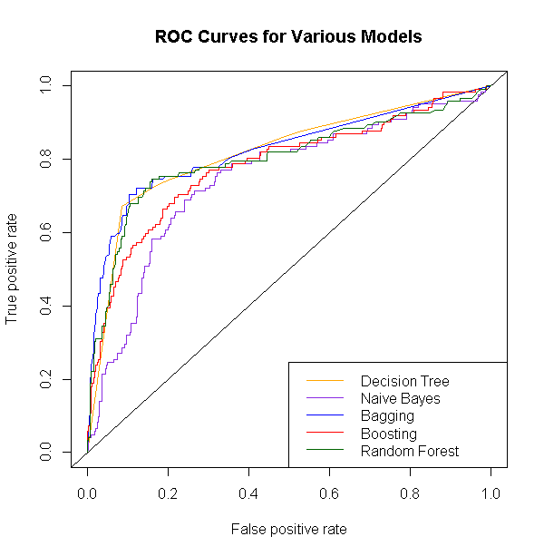
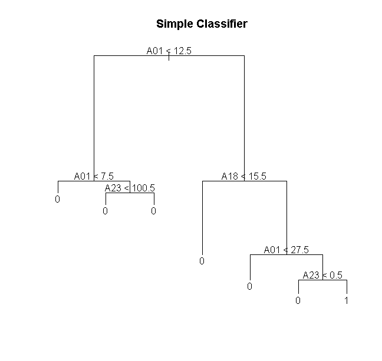

# Phishing Website Detection System



## Overview
This project implements machine learning classification models to identify fraudulent phishing websites with high accuracy. By analyzing URL and website features, the system can detect phishing attempts that might otherwise compromise user security.

## Key Features
- **85% Detection Accuracy**: Achieved using optimized decision tree models
- **Multiple Model Comparison**: Comprehensive evaluation of 5 different classification algorithms
- **Feature Optimization**: Identified that just 3 key features can maintain high classification performance
- **ROC Analysis**: Detailed performance metrics for model selection and optimization
- **Neural Network Implementation**: Extended analysis with ANN for improved performance

## Model Performance

| Model | Accuracy | AUC |
|-------|----------|-----|
| Decision Tree | 85.06% | 81.90% |
| Bagging | 84.20% | 82.54% |
| Random Forest | 82.90% | 80.31% |
| Neural Network | 83.77% | 84.32% |
| Gradient Boosting | 80.52% | 78.63% |
| Simple Model (3 features) | 85.06% | 81.84% |

## Technical Implementation

The system analyzes website attributes to detect phishing attempts. Key findings include:

1. **Feature Importance**: Attributes A01, A18, and A23 emerged as the most important predictors across all models, enabling a simplified but highly effective classifier.

2. **Simple Model Performance**: A model using only 3 features achieved the same accuracy as more complex models, demonstrating efficient feature selection.

3. **Model Optimization**: Cross-validation and hyperparameter tuning improved performance of tree-based classifiers.



## Usage

### Prerequisites
- R (>= 4.0.0)
- Required R packages (automatically installed by `requirements.R`)

### Installation
```bash
# Clone the repository
git clone https://github.com/yourusername/phishing-detection-ml.git
cd phishing-detection-ml

# Run the main script
Rscript main.R
```

### Running Individual Components
```bash
# Data preprocessing only
Rscript data_preprocessing.R

# Model training only
Rscript model_training.R

# Model evaluation only
Rscript model_evaluation.R
```

## Project Structure

```
phishing-detection-ml/
├── data/
│   └── PhishingData.csv          # Dataset (not included in repository)
├── docs/
│   └── Feature_Optimization_in_Website_Threat_Detection.pdf  # Technical report
├── images/                       # Generated visualizations
├── requirements.R                # Required packages installation
├── data_preprocessing.R          # Data cleaning and preparation
├── model_training.R              # Training of all classifiers
├── model_evaluation.R            # Performance analysis
├── feature_selection.R           # Identifying important features
├── visualization.R               # Visualization functions
├── main.R                        # Main execution script
└── README.md                     # This file
```

## Technologies
- **R**: Primary programming language
- **Machine Learning**: Decision trees, random forests, bagging, boosting, neural networks
- **Libraries**: randomForest, e1071, neuralnet, xgboost, ROCR, tree, adabag, caret

## Future Improvements
- Implementation of a web interface for real-time URL analysis
- Expansion of the training dataset to include more recent phishing techniques
- Feature engineering to identify additional predictive attributes
- Incorporation of URL text analysis using NLP techniques

## Dataset
The analysis used a dataset containing website instances with 25 predictive attributes, with approximately 70% legitimate websites and 30% phishing websites.

## License
This project is provided for educational and research purposes only.